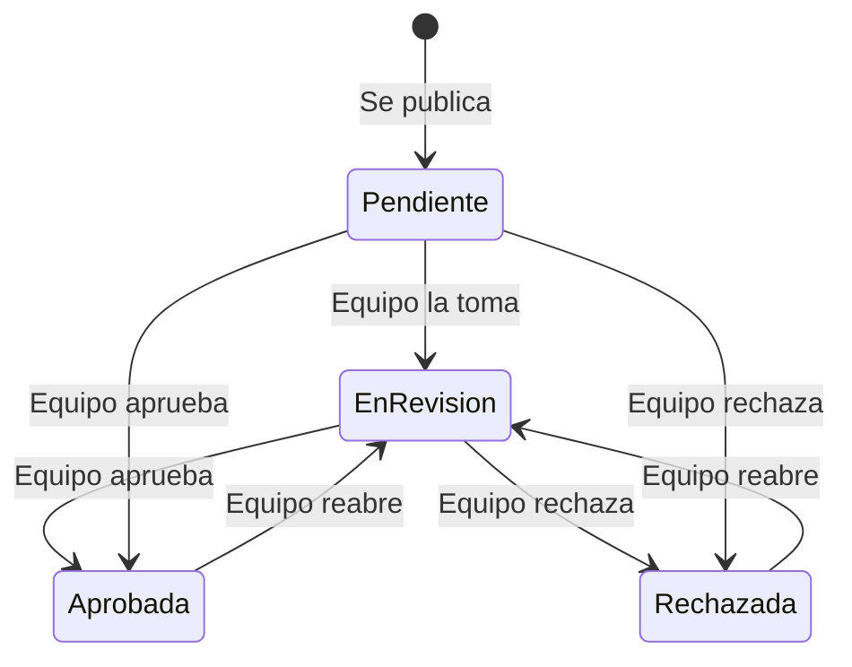
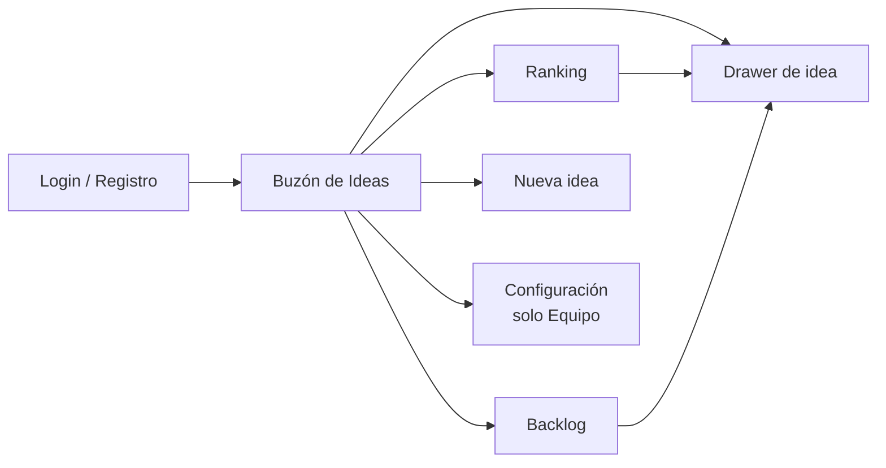

# PRD — Boxinger Beta

Sep 26, 2026 · @Carla

La Beta de Boxinger valida la idea con el plan Free: 1 board público donde el Equipo y la Comunidad cargan ideas, las votan y comentan, con un Ranking de las 10 más votadas y un Backlog de aprobadas. Las funcionalidades del plan pago no se desarrollan en esta etapa.

## 1. Objetivo y alcance de la Beta

**Objetivo.** Validar que los equipos de producto usan un buzón de ideas co-creado con su comunidad: que cargan ideas, invitan usuarios, reciben votos y comentarios, y aprueban ideas al Backlog.

**Entra en la Beta (plan Free)**

- Registro e inicio de sesión con email y contraseña o con Google (Gmail).
- 1 board público por cuenta.
- Ideas ilimitadas, con categoría y tag de origen (Equipo / Comunidad).
- Buzón de Ideas con cards y drawer de detalle.
- Votación Importante / Interesante / No importante.
- Comentarios con respuesta del Equipo y Like / No like en comentarios.
- Ranking de las 10 ideas más votadas, con estados.
- Backlog de ideas aprobadas.
- Panel de Admin de plataforma para gestionar clientes y suscripciones.
- UI light con Ant Design, responsive para mobile, tablet y desktop.

**No entra en la Beta (plan pago, USD 19/mes, a futuro)**

- Boards ilimitados.
- Boards privados para uso interno del Equipo.
- Ciclos.
- Matriz de esfuerzo e impacto.
- Roadmap con fechas de realización.
- Cobro y checkout.

El modelo de datos y el panel de Admin se diseñan para soportar el plan pago sin migraciones, aunque no se desarrollen sus funcionalidades.

## 2. Usuarios y roles

Hay un rol interno de plataforma y dos roles de cara al cliente.

| Rol | Quién es | Puede | No puede |
| --- | --- | --- | --- |
| **Admin de plataforma** | Dueña del producto Boxinger | Acceder al panel de Admin, ver y gestionar clientes, boards y suscripciones, suspender cuentas | Participar en boards de clientes como Equipo o Comunidad |
| **Equipo** | Quien crea el board (dueño) | Crear y configurar su board, cargar ideas, votar ideas de la Comunidad, responder comentarios, dar Like / No like a comentarios, cambiar estados en el Ranking, moderar | Votar sus propias ideas ni las del Equipo |
| **Comunidad** | Invitado registrado al board | Cargar ideas, votar ideas (1 vez por idea), comentar, dar Like / No like a comentarios | Responder comentarios, cambiar estados, moderar |
| **Visitante** | Alguien con el link, sin sesión | Ver el Buzón, el Ranking y el Backlog | Votar, comentar o cargar ideas (debe registrarse) |

- En la Beta cada board tiene un único usuario Equipo: su creador.
- Un mismo usuario puede ser Equipo en su board y Comunidad en boards de otros.

## 3. Boards y acceso de invitados

Un board es el proyecto donde se gestionan las ideas de un producto. En el plan Free cada cuenta crea 1 board, siempre público.

**Crear un board (Equipo)**

- Campos: nombre (obligatorio, máx. 60 caracteres), descripción corta (opcional, máx. 200), logo (opcional, PNG/JPG hasta 2 MB).
- Al crearlo se genera una URL pública única: `www.boxinger.com/app/b/<slug>`.
- Si la cuenta ya tiene 1 board, el botón Crear board muestra el aviso "Boards ilimitados en el plan pago" (sin checkout en la Beta).

**Invitar a la Comunidad**

- **Link público:** el Equipo copia la URL del board y la comparte. Quien entra y se registra queda como Comunidad de ese board.
- **Invitación por email:** el Equipo carga uno o varios emails; cada uno recibe un email con el link al board.
- Board público = cualquiera con el link puede ver las ideas. Para participar debe registrarse.

**Configuración del board (Equipo)**

- Editar nombre, descripción y logo.
- Ver la lista de miembros de la Comunidad y bloquear a un miembro (deja de poder participar; su contenido queda visible salvo que el Equipo lo oculte).

## 4. Buzón de Ideas

El Buzón de Ideas es la vista principal del board: todas las ideas en cards, filtrables por categoría y origen.

**Cargar una idea (Equipo y Comunidad)**

| Campo | Tipo | Regla |
| --- | --- | --- |
| Título | Texto | Obligatorio, 5 a 80 caracteres |
| Descripción | Texto largo | Obligatorio, 20 a 2.000 caracteres |
| Categoría | Selección única | Obligatorio: **Feature**, **Mejora funcional** o **Propuesta** |
| Origen | Automático | **Equipo** si la carga el dueño, **Comunidad** si la carga un invitado |
| Fecha | Automático | Fecha de publicación |

La idea se publica al instante, con estado **Pendiente de revisión**.

**Contenido de la card**

| Elemento | Detalle |
| --- | --- |
| Título | Completo, hasta 2 líneas |
| Descripción | Primeros 140 caracteres + "… Ver más", que abre el drawer |
| Tag de origen | Equipo o Comunidad, con color distinto |
| Categoría | Tag: Feature / Mejora funcional / Propuesta |
| Votos | Cantidad total recibida, sin detallar el tipo |
| Comentarios | Cantidad total |
| Fecha | Formato relativo ("hace 3 días"); fecha exacta al pasar el mouse |
| Botón Votar | Abre las 3 opciones de voto. Si ya votó, muestra "Votaste: Importante" |

**Drawer de detalle** (se abre al tocar la card o "Ver más")

- Título, descripción completa, tags de origen y categoría, fecha, autor, estado.
- Control de voto con las 3 opciones.
- Cantidad total de votos y de comentarios.
- Lista de comentarios con sus respuestas y Like / No like.
- Campo para comentar.
- Para el Equipo: cambiar estado, editar u ocultar la idea.
- El drawer tiene URL propia para poder compartir una idea directamente.

**Filtros y orden del Buzón**

- Filtros: categoría, origen, estado.
- Orden: más recientes (default), más votadas, más comentadas.
- Búsqueda por texto en título y descripción.

## 5. Votación

Cada idea se vota con una de tres opciones: **Importante**, **Interesante** o **No importante**. La card muestra solo la cantidad total de votos.

**Reglas**

| Regla | Detalle |
| --- | --- |
| 1 voto por idea | Cada usuario vota una sola vez cada idea |
| Cambiar el voto | Puede cambiar la opción elegida o quitar su voto en cualquier momento |
| Equipo | No vota sus propias ideas. Sí vota las ideas de la Comunidad |
| Comunidad | Vota cualquier idea del board, excepto las propias |
| Sesión | Solo usuarios registrados y con email verificado |
| Ideas aprobadas o rechazadas | Se cierran a votación; los votos quedan congelados |

**Qué ve cada rol**

- **Comunidad y visitantes:** cantidad total de votos, sin desglose por tipo. Cada usuario ve qué opción eligió.
- **Equipo:** en el drawer ve el desglose (cuántos Importante, Interesante y No importante) y el puntaje.

**Puntaje para el Ranking**

Contar solo votos haría que una idea con muchos "No importante" suba al Ranking. Por eso el Ranking ordena por puntaje ponderado, aunque en pantalla se muestre la cantidad total:

| Voto | Puntos |
| --- | --- |
| Importante | 2 |
| Interesante | 1 |
| No importante | 0 |

Desempate: 1) más votos Importante, 2) más votos totales, 3) la idea más antigua.

## 6. Ranking, estados y Backlog

El Ranking muestra las 10 ideas con mayor puntaje que todavía están en juego. Al aprobarse, una idea pasa al Backlog; al rechazarse, sale del Ranking.

**Estados de una idea**

| Estado | Color (Ant Design Tag) | Significado |
| --- | --- | --- |
| Pendiente de revisión | default (gris) | Publicada, sin revisar. Estado inicial |
| En revisión | processing (azul) | El Equipo la está evaluando |
| Aprobada | success (verde) | Pasa al Backlog. Se cierra a votación |
| Rechazada | error (rojo) | No se hará. Motivo obligatorio y visible. Se cierra a votación |

- Solo el Equipo cambia estados, desde el Ranking o desde el drawer de cualquier idea (también las que no están en el top 10).
- Cada cambio de estado queda registrado con fecha y se notifica por email al autor.

**Sección Ranking**

- Lista ordenada del 1 al 10 por puntaje, entre ideas en estado Pendiente de revisión o En revisión.
- Cada fila: posición, título, tags de origen y categoría, cantidad de votos, cantidad de comentarios, estado.
- El Equipo ve además el puntaje y un selector de estado en cada fila.
- Se actualiza al recibir votos (máximo 5 segundos de demora).
- Filtro opcional por categoría (el top 10 se recalcula dentro de la categoría).

**Sección Backlog**

- Lista de ideas en estado Aprobada, la más reciente primero.
- Cada item: la card de la idea + fecha de aprobación + votos finales.
- Filtros por categoría y origen.
- Sin fechas de realización: eso corresponde al Roadmap del plan pago.

## 7. Comentarios

Todas las ideas aceptan comentarios. La estructura es plana: **Comentario → Respuesta del Equipo**, sin hilos.

**Reglas**

| Acción | Comunidad | Equipo |
| --- | --- | --- |
| Comentar una idea | Sí | Sí (como comentario propio, no como respuesta) |
| Responder un comentario | No | Sí, 1 respuesta por comentario |
| Like / No like a un comentario o a una respuesta | Sí, 1 por comentario, cambiable | Sí |
| Like / No like a su propio comentario | No | No |
| Editar o borrar lo propio | Sí | Sí |
| Ocultar comentarios de otros | No | Sí (moderación) |

**Cómo se muestra**

- Comentarios ordenados del más antiguo al más reciente.
- Cada comentario: avatar, nombre, tag de origen (Equipo / Comunidad), fecha, texto (máx. 1.000 caracteres), contador de Like y de No like.
- La respuesta del Equipo aparece debajo del comentario, indentada y con tag **Respuesta del Equipo**.
- Un comentario editado muestra "(editado)".
- Un comentario borrado que tenía respuesta muestra "Comentario eliminado" y conserva la respuesta.

**Notificaciones por email**

- Al autor de la idea: nuevo comentario.
- Al autor del comentario: el Equipo respondió.
- Al Equipo: nuevo comentario en cualquier idea del board (resumen diario, para no saturar).

## 8. Autenticación y panel de Admin de plataforma

**Autenticación**

- **Email y contraseña:** registro con nombre, email y contraseña (mínimo 8 caracteres, al menos 1 letra y 1 número). Verificación por email antes de poder votar, comentar o cargar ideas.
- **Google (Gmail):** registro e inicio con OAuth de Google. El email llega verificado.
- Si un email ya existe con contraseña y entra con Google, se vinculan las dos formas de acceso a la misma cuenta.
- Recuperar contraseña por email (link válido 1 hora).
- Sesión persistente 30 días, con opción de cerrar sesión.
- Al registrarse desde el link de un board, el usuario vuelve a ese board y queda como Comunidad.
- Al registrarse desde la home, el onboarding lleva a crear su board (queda como Equipo).

**Panel de Admin de plataforma**

Acceso restringido a usuarios con rol Admin de plataforma, en una ruta separada (`/app/admin`).

| Sección | Contenido | Acciones |
| --- | --- | --- |
| Dashboard | Cuentas totales, boards activos, ideas, votos y comentarios; altas por semana; boards con actividad en los últimos 7 días | Filtrar por período |
| Clientes | Lista de cuentas Equipo: nombre, email, fecha de alta, método de login, plan, cantidad de boards, última actividad | Buscar, ver detalle, suspender / reactivar |
| Boards | Nombre, dueño, URL, ideas, miembros de Comunidad, última actividad | Ver board, suspender / reactivar |
| Suscripciones | Plan de cada cuenta (Free en la Beta), fecha de inicio, estado | Cambiar plan manualmente (preparado para el plan pago) |
| Usuarios | Todos los usuarios (Equipo y Comunidad) | Buscar, bloquear / desbloquear |

Una cuenta o board suspendido muestra un aviso y queda en solo lectura para todos.

## 9. Pantallas y UI

La app usa [Ant Design](https://ant.design/) en tema light (sin modo oscuro) y es responsive para mobile, tablet y desktop.

**Dominio y rutas**

| Ruta | Contenido |
| --- | --- |
| www.boxinger.com | Sitio público y promocional (landing, planes, registro) |
| www.boxinger.com/app | La aplicación: login, onboarding, perfil |
| www.boxinger.com/app/b/\<slug> | Board público: Buzón, Ranking, Backlog |
| www.boxinger.com/app/b/\<slug>/idea/\<id> | Drawer de una idea, compartible |
| www.boxinger.com/app/admin | Panel de Admin de plataforma |

**Navegación del board**

**Pantallas**

| Pantalla | Rol | Componentes Ant Design |
| --- | --- | --- |
| Login / Registro | Todos | Form, Input, Input.Password, Button (Google), Divider, Alert |
| Verificación de email | Todos | Result, Button |
| Onboarding: crear board | Equipo | Steps, Form, Upload |
| Buzón de Ideas | Todos | Layout, Menu (Buzón / Ranking / Backlog), Card, Tag, Badge, Segmented (filtros), Select, Input.Search, Empty, FloatButton (Nueva idea en mobile) |
| Drawer de idea | Todos | Drawer, Typography, Tag, Radio.Group o Segmented (voto), Statistic, List (comentarios), Avatar, Input.TextArea, Popconfirm |
| Nueva idea | Equipo, Comunidad | Modal (desktop) / Drawer (mobile), Form, Input, Input.TextArea con contador, Radio.Group (categoría) |
| Ranking | Todos | List o Table, Tag de estado, Select de estado (Equipo), Modal para motivo de rechazo |
| Backlog | Todos | List, Card, Tag, Select de filtros |
| Configuración del board | Equipo | Form, Upload, Typography.Paragraph copyable (URL), Select mode=tags (invitar emails), Table (miembros) |
| Perfil | Todos | Form, Avatar, Switch (notificaciones) |
| Panel Admin | Admin de plataforma | Layout con Sider, Table, Statistic, Descriptions, Tag, Button, Modal |

**Responsive (breakpoints de Ant Design Grid)**

| Dispositivo | Breakpoint | Buzón | Navegación | Drawer |
| --- | --- | --- | --- | --- |
| Mobile | xs / sm (< 768 px) | 1 card por fila | Menú inferior o Menu horizontal compacto | Pantalla completa |
| Tablet | md (≥ 768 px) | 2 cards por fila | Menu horizontal | 70 % del ancho |
| Desktop | lg / xl (≥ 992 px) | 3 cards por fila | Menu horizontal en header | 480 px a la derecha |

**Lineamientos visuales**

- Tema light con ConfigProvider y tokens de Ant Design; color primario #2f6b5e (colorPrimary en el token de Ant Design).
- Tag de origen: Equipo y Comunidad con colores fijos y distintos entre sí, consistentes en toda la app.
- Estados vacíos con Empty y un llamado a la acción ("Cargá la primera idea").
- Feedback de acciones con message (votar, comentar, cambiar estado).

## 10. Requisitos funcionales

| ID | Como… | Quiero… | Criterio de aceptación |
| --- | --- | --- | --- |
| RF-01 | Usuario | Registrarme con email y contraseña | Recibo un email de verificación; hasta verificar puedo ver pero no participar |
| RF-02 | Usuario | Entrar con Google | Accedo sin verificación adicional; si mi email ya existía, se vincula a mi cuenta |
| RF-03 | Usuario | Recuperar mi contraseña | Recibo un link válido por 1 hora |
| RF-04 | Equipo | Crear mi board | Obtengo una URL pública única; no puedo crear un segundo board en Free |
| RF-05 | Equipo | Invitar a la Comunidad | Copio el link o envío invitaciones por email; quien se registra desde ahí queda como Comunidad |
| RF-06 | Equipo / Comunidad | Cargar una idea | Completo título, descripción y categoría; se publica con tag de origen y estado Pendiente de revisión |
| RF-07 | Usuario | Ver el Buzón de Ideas | Veo cards con título, 140 caracteres de descripción, votos, comentarios, origen, categoría, fecha y botón Votar |
| RF-08 | Usuario | Ver una idea completa | El drawer muestra todo el detalle y tiene URL compartible |
| RF-09 | Usuario | Filtrar y ordenar el Buzón | Filtro por categoría, origen y estado; ordeno por recientes, votadas o comentadas; busco por texto |
| RF-10 | Comunidad | Votar una idea | Elijo Importante, Interesante o No importante; un voto por idea; puedo cambiarlo o quitarlo; no puedo votar mis ideas |
| RF-11 | Equipo | Votar ideas de la Comunidad | Puedo votar ideas con origen Comunidad; el botón no aparece en ideas del Equipo |
| RF-12 | Equipo | Ver el desglose de votos | En el drawer veo cantidad por tipo y puntaje; la Comunidad solo ve el total |
| RF-13 | Usuario | Ver el Ranking | Veo las 10 ideas con mayor puntaje entre Pendiente de revisión y En revisión |
| RF-14 | Equipo | Cambiar el estado de una idea | Desde el Ranking o el drawer; al rechazar, el motivo es obligatorio; el autor recibe un email |
| RF-15 | Usuario | Ver el Backlog | Veo las ideas Aprobadas, la más reciente primero, con fecha de aprobación |
| RF-16 | Usuario | Comentar una idea | Mi comentario aparece con mi nombre, tag de origen y fecha |
| RF-17 | Equipo | Responder un comentario | 1 respuesta por comentario, marcada como Respuesta del Equipo; el autor recibe un email |
| RF-18 | Comunidad | Responder un comentario | No hay opción de responder |
| RF-19 | Usuario | Dar Like / No like a un comentario | 1 reacción por comentario, cambiable; no en los propios |
| RF-20 | Equipo | Moderar | Puedo editar u ocultar ideas y comentarios de mi board y bloquear miembros |
| RF-21 | Admin de plataforma | Gestionar clientes y boards | Veo listados con métricas y puedo suspender o reactivar |
| RF-22 | Admin de plataforma | Gestionar suscripciones | Veo el plan de cada cuenta y puedo cambiarlo manualmente |
| RF-23 | Usuario | Usar la app en cualquier dispositivo | Todas las pantallas funcionan en mobile, tablet y desktop sin scroll horizontal |

**Requisitos no funcionales**

- Idioma de la Beta: español.
- Carga del Buzón en menos de 2 segundos con 200 ideas (paginación o scroll infinito de 20 en 20).
- Rate limit de registro, votos y comentarios para frenar bots.
- Contraseñas con hash seguro; tokens de sesión con expiración.
- Cumplimiento básico de privacidad: términos, política de privacidad y opción de borrar la cuenta.

## 11. Modelo de datos

Entidades de la Beta. Account y Subscription existen desde el inicio para sumar el plan pago sin migrar.

| Entidad | Campos clave |
| --- | --- |
| User | nombre, email, email\_verificado, password\_hash (opcional), google\_id (opcional), avatar, es\_admin\_plataforma, estado (activo / bloqueado), creado\_en |
| Account | dueño (User), nombre, estado (activa / suspendida), creada\_en |
| Subscription | account, plan (free / pago), estado, inicio, fin |
| Board | account, nombre, slug, descripción, logo, visibilidad (público en Free), estado, creado\_en |
| BoardMember | board, user, rol (equipo / comunidad), estado (activo / bloqueado), unido\_en |
| Invitation | board, email, enviada\_en, aceptada\_en |
| Idea | board, autor, origen (equipo / comunidad), título, descripción, categoría (feature / mejora\_funcional / propuesta), estado (pendiente / en\_revision / aprobada / rechazada), motivo\_rechazo, aprobada\_en, oculta, creada\_en |
| Vote | idea, user, valor (importante / interesante / no\_importante), creado\_en, actualizado\_en |
| Comment | idea, user, texto, editado, oculto, eliminado, creado\_en |
| CommentReply | comment, user (Equipo), texto, editado, creado\_en |
| CommentReaction | comment o reply, user, valor (like / no\_like) |
| StatusChange | idea, estado\_anterior, estado\_nuevo, user, fecha |
| Notification | user, tipo, idea, enviada\_en |

**Restricciones**

- Vote único por (idea, user). Rechazado si user es el autor de la idea, o si es Equipo y la idea tiene origen Equipo.
- CommentReply único por comment.
- CommentReaction único por (comentario o respuesta, user). Rechazado si user es el autor.
- En plan Free: 1 Board por Account.

**Puntaje (calculado):** puntaje = 2 × importante + 1 × interesante; votos\_totales = importante + interesante + no\_importante.

## 12. Planes, métricas de validación y decisiones

**Planes** (en la Beta solo se desarrolla Free)

| Funcionalidad | Free (Beta) | Pago — USD 19/mes (futuro) |
| --- | --- | --- |
| Boards | 1 | Ilimitados |
| Visibilidad del board | Público | Público o privado (uso interno del Equipo) |
| Ideas | Ilimitadas | Ilimitadas |
| Votar y comentar | Sí | Sí |
| Ranking y Backlog | Sí | Sí |
| Ciclos | No | Sí |
| Matriz esfuerzo / impacto | No | Sí |
| Roadmap con fechas | No | Sí |

**Métricas para validar la Beta**

| Métrica | Qué valida | Meta a 60 días |
| --- | --- | --- |
| Boards creados | Interés de equipos de producto | ≥ 30 |
| Boards activos | % con al menos 5 ideas y 1 miembro de Comunidad | ≥ 40 % |
| Invitados por board | Que el Equipo realmente abre el board a su comunidad | ≥ 10 en promedio |
| Ideas de la Comunidad | % de ideas con origen Comunidad | ≥ 50 % |
| Participación | % de miembros de Comunidad que votan al menos 1 idea | ≥ 50 % |
| Uso del flujo completo | % de boards con al menos 1 idea Aprobada | ≥ 30 % |
| Retención del Equipo | % de dueños que vuelven en la semana 4 | ≥ 40 % |
| Intención de pago | Clics en funciones del plan pago ("Crear otro board", etc.) | Medir |

**Decisiones confirmadas** (confirmadas el 26/09/2026):

- El Ranking ordena por puntaje ponderado (Importante 2, Interesante 1, No importante 0) y no por cantidad de votos.
- Un miembro de la Comunidad no puede votar sus propias ideas.
- El Equipo ve el desglose de votos; la Comunidad solo ve el total.
- Las ideas Aprobadas y Rechazadas salen del Ranking y se cierran a votación.
- Al rechazar, el motivo es obligatorio y visible.
- El Equipo puede aprobar ideas que no están en el top 10.
- Un solo usuario Equipo por board en la Beta.
- Invitación por link público y por email.
- Idioma de la Beta: solo español.
- Marca: Boxinger. Dominio: www.boxinger.com (sitio público y promocional); la app vive en /app. Color primario: #2f6b5e.
