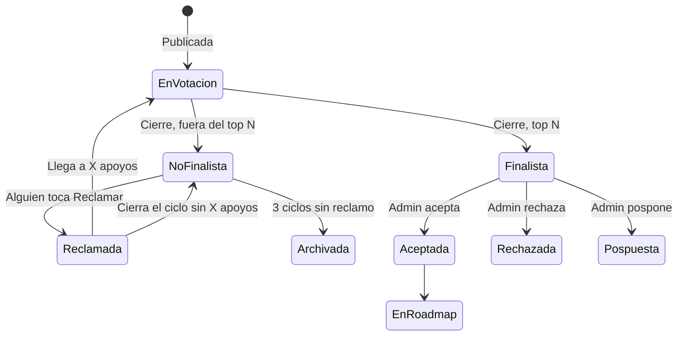
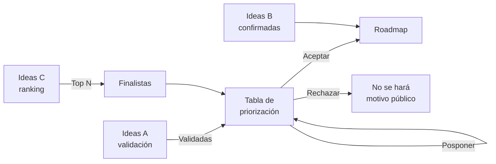

# PRD — Insight Backlog MVP

Sep 24, 2026 · @Carla

Insight Backlog es un board de ideas donde empresa y usuarios proponen, votan y deciden en ciclos qué entra al roadmap. El MVP cubre 1 board con ciclos ilimitados, 3 tipos de idea, ranking en vivo, priorización del admin y roadmap público.

## 1. Problema y objetivo

**Problema.** Los productos digitales reciben ideas de sus usuarios por canales dispersos (soporte, redes, encuestas) y deciden el roadmap sin un mecanismo visible de consenso. Las herramientas existentes resuelven la mitad:

- **Nolt / Canny:** board abierto con votos, pero el ranking es histórico y acumulado, el paso al roadmap es manual y no hay un momento en que "la comunidad decide".
- **Productboard:** el voto tiene nivel de importancia y aporta evidencia, pero el portal es curado por la empresa y no hay conversación ni ranking público.

**Objetivo.** Un gran board de ideas consensuadas entre empresa y usuarios que, por ciclos, alimenta un roadmap co-creado.

**Propuesta de valor.**

1. **Ciclos con ganadoras:** cada mes o trimestre se cierra un ranking y las finalistas pasan a evaluación. Es un ritual que genera retorno.
2. **Tres tipos de idea en un mismo board:** validar ideas del equipo, medir impacto de lo ya confirmado y dar voz a las ideas de la comunidad.
3. **Priorización alimentada por votos:** el impacto se sugiere desde los votos; la voz del usuario entra en la decisión, no queda decorativa.
4. **Roadmap con origen visible:** cada ítem muestra si vino del Equipo o de la Comunidad y en qué ciclo ganó.

**Resultado esperado del MVP.** Un producto puede operar 1 board con ciclos ilimitados de punta a punta: publicar ideas, votar, cerrar el ciclo, priorizar y publicar el roadmap.

## 2. Usuarios y roles

El MVP tiene dos roles. Roles adicionales (editor, equipo técnico) quedan para el plan pago.

| Rol | Quién es | Puede |
| --- | --- | --- |
| **Admin** | Dueño del producto, PM o fundador | Configurar board y ciclos, publicar ideas A y B, moderar, ver resultados privados, priorizar, aceptar o rechazar, gestionar el roadmap |
| **Usuario** | Cliente o usuario del producto, registrado con email verificado | Publicar ideas C, votar A, B y C, comentar, reclamar y apoyar No finalistas, seguir ideas |
| **Visitante** | Cualquiera con la URL del board | Ver ideas, ranking público y roadmap. Para votar o publicar debe registrarse |

**Registro.** Email + contraseña o magic link. El voto cuenta solo con email verificado.

## 3. Alcance

**Entra en el MVP**

- 1 board por cuenta, accesible por URL pública.
- Ciclos mensuales o trimestrales, ilimitados, uno activo a la vez.
- Ideas tipo A, B y C con sus sistemas de voto.
- Ranking en vivo de ideas C.
- Comentarios con reglas de visibilidad por tipo.
- Flujo de No finalistas: congelar, reclamar, apoyar, volver a competir, archivar.
- Tablero público de Finalistas con estado.
- Tabla de priorización del admin (impacto, esfuerzo, revenue, criticidad).
- Roadmap público con origen y estado.
- Moderación posterior y reportes.
- Notificaciones por email.
- Botón "Proponé una idea" (link) para poner dentro del producto.

**Queda fuera del MVP**

- Múltiples boards.
- Widget embebible para votar dentro del producto.
- Integraciones (Slack, Jira, Linear, Intercom, etc.).
- SSO con la cuenta del producto.
- Dominio y branding propios.
- Segmentación de votos por tipo de cliente.
- Roles adicionales.
- Changelog, export y API.
- IA para agrupar temas o detectar duplicados semánticos.

## 4. Tipos de idea, votos y puntajes

Conviven tres tipos de idea en el mismo board. Cada una lleva un badge de origen: **Equipo** o **Comunidad**.

| Tipo | Publica | Opciones de voto | ¿Compite en el ciclo? | Destino |
| --- | --- | --- | --- | --- |
| **A. Equipo, a validar** | Admin | Importante / Deseable / No importante | Sí, contra un umbral de validación | Si se valida, va a priorización |
| **B. Equipo, confirmada** | Admin | Importante / No importante | No | Va al roadmap sí o sí; mide impacto esperado |
| **C. Comunidad** | Usuario | 👍 / 👎 | Sí, en el ranking público | Top N pasa a Finalistas |

**Reglas comunes de voto**

- 1 usuario = 1 voto por idea. Puede cambiarlo o quitarlo mientras el ciclo esté abierto.
- El voto cuenta solo con email verificado.
- El autor de una idea C no puede votarla.
- Al cerrar el ciclo los votos se congelan.

**Tipo A — Índice de validación (solo admin)**

- Importante = 2, Deseable = 1, No importante = 0.
- Índice = promedio (0 a 2), junto al % de Importante y la cantidad de respuestas.
- Queda **Validada** si cumple el umbral configurable. Default: ≥ 60 % Importante y ≥ 10 respuestas.

**Tipo B — Impacto esperado (solo admin)**

- % Importante sobre el total de respuestas.
- Alerta al admin si No importante supera el 50 % (configurable).

**Tipo C — Ranking de la comunidad (público, en vivo)**

- Score = 👍 − 👎. Se muestran ambos conteos.
- Desempate: gana la idea que alcanzó ese score primero.
- Motivo opcional al votar 👎 ("¿Qué te preocupa?"), visible solo para el admin.
- Opción del admin: mostrar el conteo solo después de votar, para reducir el efecto manada.

## 5. Ciclos, Finalistas y No finalistas

Cada board tiene un ciclo activo a la vez. Al cerrarlo, las top N ideas C pasan a Finalistas y el resto queda No finalista y congelado.

**Configuración del ciclo (admin)**

| Parámetro | Opciones | Default |
| --- | --- | --- |
| Duración | Mensual / Trimestral | Mensual |
| Fecha de inicio | Fecha | Primer día del mes siguiente |
| Top N finalistas (C) | Número | 3 |
| Apoyos para reclamar | Número | 5 |
| Ciclos sin reclamo antes de archivar | Número | 3 |
| Mostrar conteo solo después de votar (C) | Sí / No | No |

Al cerrar un ciclo, el siguiente se abre automáticamente con la misma configuración. El admin puede editarla antes de que empiece.

**Ciclo de vida de una idea C**



Pospuesta queda en la tabla de priorización para el ciclo siguiente, sin volver a votación.

**Reglas de No finalistas**

1. Quedan visibles con la etiqueta **No finalista**, congeladas: no se pueden votar.
2. Cualquier usuario toca **Reclamar**. Ese reclamo cuenta como el primer apoyo.
3. La idea muestra **"Reclamada: faltan N apoyos"**. Otros usuarios se suman con **Apoyar** (1 apoyo por usuario).
4. Al llegar a X apoyos vuelve a competir en el ciclo en curso.
5. Los votos arrancan en cero. El historial queda visible ("34 👍 en septiembre").
6. Si el ciclo cierra sin llegar a X apoyos, el reclamo vence y los apoyos no se arrastran.
7. Tras 3 ciclos sin reclamo se archiva. El contador vuelve a cero cada vez que la idea compite y no gana.

## 6. Cierre de ciclo, priorización y roadmap

Al cierre, las Finalistas C y las ideas A validadas entran a la tabla de priorización. Lo aceptado pasa al roadmap junto con las ideas B.



**Qué pasa al cerrar el ciclo**

1. Se congelan los votos de A, B y C.
2. Las top N ideas C pasan a **Finalista**; el resto a **No finalista**.
3. Las ideas A que cumplen el umbral pasan a **Validada** y entran a priorización. Las que no, quedan **No validada**: el admin las archiva o las relanza en el ciclo siguiente.
4. Se publica el tablero de Finalistas del ciclo y se notifica a quienes votaron.

**Tablero de Finalistas (vista usuario)**

- Agrupado por ciclo, el más reciente arriba.
- Cada finalista muestra posición, score final y estado: **En evaluación → Aceptada / No se hará (con motivo)**.

**Tabla de priorización (vista admin)**

| Criterio | Escala | Fuente |
| --- | --- | --- |
| Impacto | 1–5 | Sugerido desde los votos, editable |
| Esfuerzo | 1–5 | Admin |
| Revenue | 1–5 | Admin |
| Criticidad | 1–5 | Admin; en ideas A, sugerido desde el % Importante |

Puntaje sugerido, ordenable:

```latex
\text{Puntaje} = \frac{\text{Impacto} + \text{Revenue} + \text{Criticidad}}{\text{Esfuerzo}}
```

- **Impacto sugerido (C):** percentil del score de la idea entre las finalistas históricas del board, llevado a 1–5.
- **Criticidad sugerida (A):** % Importante llevado a 1–5 (0–19 % = 1 … 80–100 % = 5).
- Vista alternativa: matriz Impacto vs Esfuerzo con cuatro cuadrantes (quick wins, grandes apuestas, relleno, descartar).
- Acciones por fila: **Aceptar al roadmap**, **Rechazar** (motivo obligatorio y público), **Posponer**.

**Roadmap (vista pública)**

- Fuentes: ideas B, ideas A validadas y aceptadas, finalistas C aceptadas.
- Vista temporal por mes o trimestre, con columnas de estado: **Planificada → En desarrollo → Lanzada**.
- Cada ítem muestra badge de origen (Equipo / Comunidad) y el ciclo en que ganó.
- Las ideas B siguen aceptando Importante / No importante en el roadmap.
- Filtros: origen, estado, período.

## 7. Visibilidad, moderación y notificaciones

Las ideas A funcionan como feedback privado; las B y C como conversación pública.

| Tipo | Conteo de votos | Comentarios de usuarios | Quién votó |
| --- | --- | --- | --- |
| **A. Validar** | Solo admin | Solo admin (cada usuario ve el suyo) | Solo admin |
| **B. Confirmada** | Solo admin (opción de hacerlo público) | Públicos | Solo admin |
| **C. Comunidad** | Público (opción "mostrar después de votar") | Públicos | Solo admin |

- Las respuestas del admin son siempre públicas y se destacan como **Respuesta oficial**.
- En ideas A, la respuesta oficial del admin es visible para todos aunque los comentarios de usuarios sean privados.

**Moderación**

- Las ideas y comentarios se publican directo, sin aprobación previa.
- El admin puede ocultar, editar, eliminar y fusionar ideas duplicadas. Al fusionar, los votos se suman sin duplicar usuarios.
- Los usuarios pueden reportar ideas y comentarios. Los reportes llegan a una bandeja del admin.
- Al escribir una idea C, se sugieren ideas parecidas por título para evitar duplicados.

**Notificaciones por email**

| Evento | Destinatarios |
| --- | --- |
| Tu idea recibió un comentario | Autor |
| Respuesta oficial en una idea | Autor, votantes, seguidores |
| Cierre de ciclo: tu idea es Finalista / No finalista | Autor |
| Cierre de ciclo: resumen de Finalistas | Todos los usuarios del board |
| Una idea que votaste o seguiste cambió de estado | Autor, votantes, seguidores |
| Una idea que reclamaste o apoyaste vuelve a competir | Quien reclamó y quienes apoyaron |
| Nuevo reporte | Admin |
| Faltan 3 días para el cierre del ciclo | Admin |
| Alerta de idea B con alto No importante | Admin |

Cada usuario puede apagar los emails por tipo desde su perfil.

## 8. Pantallas y requisitos funcionales

El MVP tiene 7 pantallas de usuario y 7 de admin.

**Pantallas de usuario**

| Pantalla | Para qué | Componentes clave |
| --- | --- | --- |
| Board (home) | Ver y votar ideas del ciclo | Header del ciclo (nombre, fecha de cierre, cuenta regresiva), tabs **Comunidad / Del equipo / No finalistas**, ranking C, botón Proponer idea, filtros |
| Detalle de idea | Votar, comentar, seguir | Título, descripción, badge de origen, control de voto según tipo, conteos según visibilidad, historial de ciclos, comentarios, respuesta oficial, Seguir, Reportar |
| Proponer idea | Publicar una idea C | Título, descripción, categoría, sugerencia de duplicados mientras escribe |
| No finalistas | Reclamar y apoyar | Lista congelada, estado del reclamo, barra "faltan N apoyos", botones Reclamar / Apoyar |
| Finalistas | Ver ganadoras por ciclo | Ciclos agrupados, posición, score final, estado y motivo |
| Roadmap | Ver qué se va a hacer | Columnas Planificada / En desarrollo / Lanzada, período, badge de origen, filtros |
| Registro y perfil | Cuenta y preferencias | Registro, verificación de email, mis ideas, mis votos, preferencias de notificación |

**Pantallas de admin**

| Pantalla | Para qué | Componentes clave |
| --- | --- | --- |
| Dashboard | Estado del ciclo en curso | Días restantes, ideas nuevas, votos, participantes, top 5 C, ideas A cerca del umbral, alertas B, reportes pendientes |
| Ideas del equipo | Publicar y seguir A y B | Crear idea A o B, resultados privados (índice, % Importante, comentarios, motivos) |
| Moderación | Mantener el board limpio | Bandeja de reportes, ocultar, editar, eliminar, fusionar duplicados |
| Cierre de ciclo | Revisar y confirmar el cierre | Vista previa de finalistas y A validadas, confirmar cierre (automático en la fecha si el admin no actúa) |
| Priorización | Decidir qué entra | Tabla con criterios y puntaje, vista matriz, Aceptar / Rechazar / Posponer |
| Roadmap (gestión) | Mover estados | Tablero por estado, asignar período, cambiar estado (dispara notificaciones) |
| Configuración | Board y ciclos | Nombre, logo, URL, parámetros del ciclo, umbrales A y B, visibilidad, botón para el producto |

**Requisitos funcionales**

| ID | Como… | Quiero… | Criterio de aceptación |
| --- | --- | --- | --- |
| RF-01 | Usuario | Registrarme y verificar mi email | No puedo votar ni publicar hasta verificar; el link vence en 24 h |
| RF-02 | Usuario | Publicar una idea C | Se publica al instante en el ciclo activo con badge Comunidad; veo sugerencias de duplicados antes de enviar |
| RF-03 | Usuario | Votar 👍 / 👎 una idea C | Un voto por idea, editable hasta el cierre; no puedo votar mi propia idea; el ranking se actualiza en vivo |
| RF-04 | Usuario | Indicar importancia en una idea A | Elijo 1 de 3 opciones y puedo comentar; no veo resultados de otros |
| RF-05 | Usuario | Indicar importancia en una idea B | Elijo 1 de 2 opciones; veo comentarios públicos |
| RF-06 | Usuario | Comentar ideas | Comentarios en A solo visibles para mí y el admin; en B y C públicos |
| RF-07 | Usuario | Reclamar una No finalista | Mi reclamo cuenta como primer apoyo; se muestra "faltan N apoyos" |
| RF-08 | Usuario | Apoyar un reclamo | Un apoyo por usuario; al llegar a X la idea vuelve a En votación con votos en cero |
| RF-09 | Usuario | Ver Finalistas y Roadmap | Veo estado, origen y motivo de rechazo cuando aplica |
| RF-10 | Usuario | Seguir una idea | Recibo emails de cambios de estado y respuestas oficiales |
| RF-11 | Usuario | Reportar contenido | El reporte llega a la bandeja del admin |
| RF-12 | Admin | Configurar el ciclo | Elijo mensual o trimestral, top N, apoyos, umbrales; aplica al próximo ciclo si hay uno activo |
| RF-13 | Admin | Publicar ideas A y B | Aparecen con badge Equipo en la tab Del equipo |
| RF-14 | Admin | Ver resultados privados | Veo índice, % Importante, cantidad, comentarios y motivos de 👎 |
| RF-15 | Admin | Moderar | Puedo ocultar, editar, eliminar y fusionar; al fusionar los votos se suman sin duplicar usuarios |
| RF-16 | Admin | Cerrar el ciclo | Al cierre se congelan votos, se asignan Finalista / No finalista / Validada y se envían notificaciones |
| RF-17 | Admin | Priorizar | Veo impacto y criticidad sugeridos, cargo el resto, ordeno por puntaje y decido |
| RF-18 | Admin | Rechazar una finalista | El motivo es obligatorio y se muestra en el tablero de Finalistas |
| RF-19 | Admin | Gestionar el roadmap | Cambio estado y período; cada cambio notifica a los interesados |
| RF-20 | Admin | Responder oficialmente | Mi respuesta queda destacada y visible para todos |

**Requisitos no funcionales**

- Responsive, mobile first: la mayoría de los usuarios llega desde un link.
- Ranking actualizado en menos de 5 segundos tras un voto.
- Español e inglés desde el día uno.
- Cierre de ciclo automático por fecha, en la zona horaria del board.
- Rate limit en votos y registro para frenar bots.

## 9. Modelo de datos

Entidades principales y sus campos clave. Todo se agrupa bajo Organization para soportar varios boards en el plan pago sin migrar.

| Entidad | Campos clave |
| --- | --- |
| Organization | nombre, plan |
| Board | organization, nombre, slug/URL, logo, idioma, zona horaria, configuración de visibilidad |
| User | email, email\_verificado, nombre, preferencias de notificación |
| Membership | user, board, rol (admin / usuario) |
| Cycle | board, tipo (mensual / trimestral), inicio, fin, top\_n, apoyos\_requeridos, ciclos\_para\_archivar, umbrales A y B, estado (programado / activo / cerrado) |
| Idea | board, tipo (A / B / C), autor, título, descripción, categoría, estado, ciclo\_actual, ciclos\_sin\_reclamo, merged\_into, oculta |
| IdeaCycleEntry | idea, ciclo, score\_final, posición, resultado |
| Vote | usuario, idea, ciclo, valor (importante / deseable / no\_importante / up / down), motivo, fecha |
| Claim | idea, iniciado\_por, ciclo, apoyos\_requeridos, estado (abierto / cumplido / vencido) |
| ClaimSupport | claim, usuario, fecha |
| Comment | idea, usuario, texto, es\_oficial, oculto |
| Follow | usuario, idea |
| Report | objeto (idea / comentario), usuario, motivo, estado |
| Prioritization | idea, ciclo, impacto, esfuerzo, revenue, criticidad, puntaje, decisión, motivo |
| RoadmapItem | idea, período, estado (planificada / en\_desarrollo / lanzada) |
| StatusChange | idea, estado\_anterior, estado\_nuevo, usuario, fecha |
| Notification | usuario, tipo, idea, enviada\_en |

**Estados de Idea:** en\_votacion, finalista, no\_finalista, reclamada, validada, no\_validada, aceptada, rechazada, pospuesta, en\_roadmap, lanzada, archivada.

**Restricciones:** Vote único por (usuario, idea, ciclo); ClaimSupport único por (usuario, claim); un solo Cycle activo por Board.

## 10. Planes y monetización

El plan gratis es el MVP completo para 1 board. El pago suma escala y presencia dentro del producto. Precios a definir; de referencia, Nolt cobra USD 29/mes por 1 board y no tiene plan gratis.

|  | Gratis | Pago |
| --- | --- | --- |
| Boards | 1 | Ilimitados |
| Ciclos | Ilimitados | Ilimitados |
| Ideas A, B y C, priorización y roadmap | Sí | Sí |
| Acceso de usuarios | URL del board + botón "Proponé una idea" | URL + widget dentro del producto |
| Widget embebible (votar sin salir del producto) | No | Sí |
| Integraciones (Slack, Jira, Linear, etc.) | No | Sí |
| Marca "Hecho con Insight Backlog" | Visible | Removible |

**Candidatos para el plan pago (a validar):** dominio y branding propios, SSO con la cuenta del producto, segmentación de votos por tipo de cliente, export, roles adicionales.

## 11. Métricas, riesgos y preguntas abiertas

**Métricas de éxito**

| Métrica | Qué mide | Meta inicial |
| --- | --- | --- |
| Participación por ciclo | % de usuarios registrados que votan al menos una vez | ≥ 30 % |
| Ideas C por ciclo | Volumen de propuestas de la comunidad | ≥ 10 por board |
| Retorno entre ciclos | % de votantes de un ciclo que vuelven a votar en el siguiente | ≥ 40 % |
| Tasa de aceptación | % de finalistas que llegan al roadmap | 50–80 % |
| Tiempo a decisión | Días entre cierre del ciclo y Aceptar / Rechazar | ≤ 14 días |
| Conversión a pago | % de boards gratis que pasan a pago en 90 días | A definir |

**Riesgos**

| Riesgo | Mitigación |
| --- | --- |
| Baja participación en el plan gratis porque el usuario sale del producto | Botón "Proponé una idea" gratis; recordatorios de cierre de ciclo |
| Cuentas falsas para inflar votos | Email verificado, rate limit, detección de patrones; SSO en el plan pago |
| Ganadoras que no se hacen y rompen la confianza | Estado visible y motivo público obligatorio al rechazar |
| 👎 desanima a quien publica | Motivo opcional y privado; opción de mostrar conteos después de votar |
| Board lleno de ideas viejas | Congelamiento de No finalistas y archivo tras 3 ciclos |
| Pocos votos hacen el umbral de A poco confiable | Mínimo de respuestas en el umbral |

**Preguntas abiertas** — supuestos de este PRD que no se definieron explícitamente:

- [ ] ¿El autor de una idea C puede votarla? (supuesto: no)
- [ ] Umbral de validación A por defecto (supuesto: ≥ 60 % Importante y ≥ 10 respuestas)
- [ ] Umbral de alerta B (supuesto: > 50 % No importante)
- [ ] Top N por defecto (supuesto: 3)
- [ ] ¿El ciclo cierra automáticamente en la fecha o espera confirmación del admin? (supuesto: automático)
- [ ] Fórmula de impacto sugerido para ideas C (supuesto: percentil del score)
- [ ] Idiomas del MVP (supuesto: español e inglés)
- [ ] Precio del plan pago

**Fuentes del benchmark:** [Nolt — Features](https://nolt.io/features), [Nolt — Pricing](https://nolt.io/pricing), [Productboard — Portals](https://support.productboard.com/hc/en-us/articles/360056315454-Use-the-Portal-to-share-your-plans-and-collect-feedback-at-scale), [Productboard — Customer Importance Score](https://support.productboard.com/hc/en-us/articles/360058215013-Use-the-Customer-Importance-Score-to-surface-your-top-requested-features), [Canny — Comments](https://help.canny.io/en/articles/5795311-comments), [Featurebase — Hiding vote count](https://help.featurebase.app/articles/7828579-hiding-vote-count-until-upvoted).
